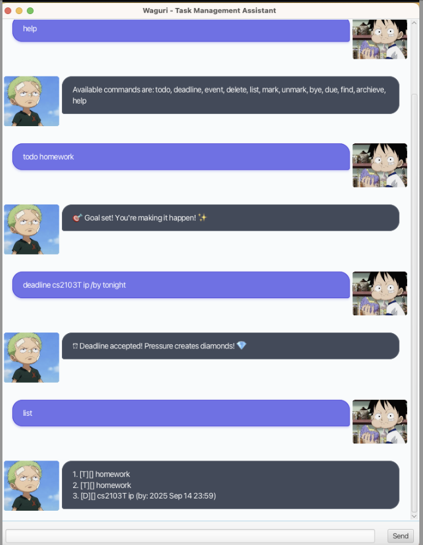

# Waguri User Guide

This is a chatbot designed for task management. 
There are several methods that users can use, which includes: todo, deadline, event, delete, list, mark, unmark, bye, due, find, archieve, help.

## Viewing Help: help
Shows a list of all available commands.

    Format: help

## Listing All Tasks: list
Displays all tasks in your task list.

    Format: list

## Adding a Todo Task: todo

Adds a simple task with no time constraint.

    Format: todo TASK_DESCRIPTION

Example:

    todo Read book

    todo 100 pushups

## Adding a Deadline Task: deadline
Adds a task that needs to be completed by a specific date/time.

    Format: deadline TASK_DESCRIPTION /by DATE_TIME

Example:

    deadline CS2103T iP /by tonight
    deadline Submit report /by Sep 18 2025 5pm

## Adding an Event Task: event
Adds a task that occurs over a specific period of time.

    Format: event TASK_DESCRIPTION /from START_TIME /to END_TIME

Example:

    event Hackathon /from Sept 18 2025 /to Sept 19 2025
    event Team meeting /from Mon 2pm /to Mon 4pm

## Marking a Task as Done: mark
Marks the task at the specified index as completed.

    Format: mark INDEX

Example:

    mark 1 - Marks the first task in the list as done.

## Unmarking a Task: unmark
Marks the task at the specified index as not completed.

    Format: unmark INDEX

Example:

    unmark 2 - Marks the second task in the list as not done.

## Deleting a Task: delete
Removes the task at the specified index from the list permanently.

    Format: delete INDEX

Example:

    delete 3 - Deletes the third task in the list.

## Finding Tasks: find
Searches for tasks containing the given keyword(s).

Format: find KEYWORD

Example:

    find book - Returns tasks like "Read book" or "Buy textbook"
    find cs2103t ip

## Viewing Due Tasks: due
Lists all deadlines due on a specific date.

    Format: due DATE

Example:

    due Sep 18 2025
    due today

